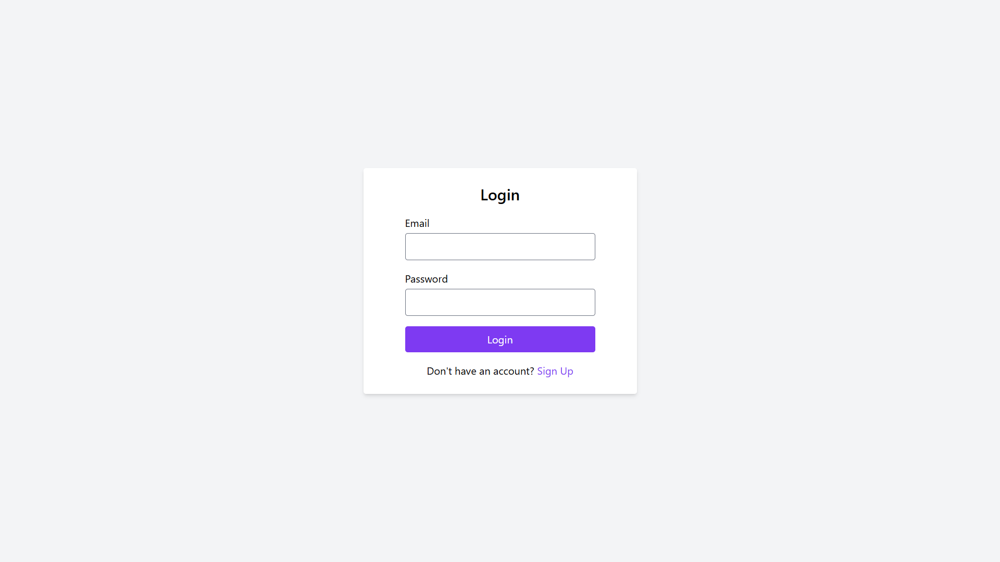
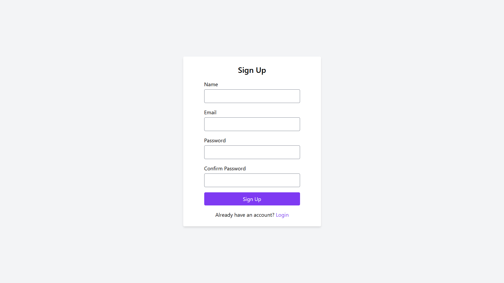
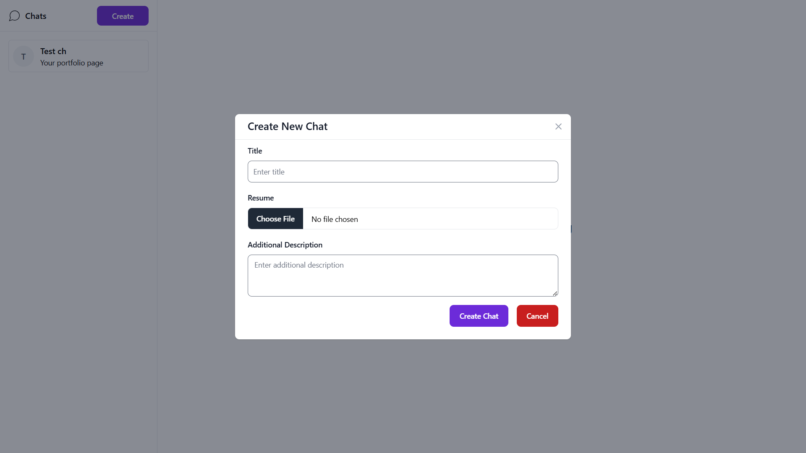
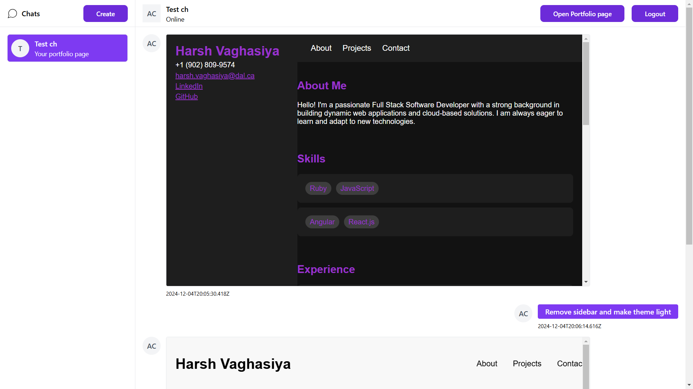
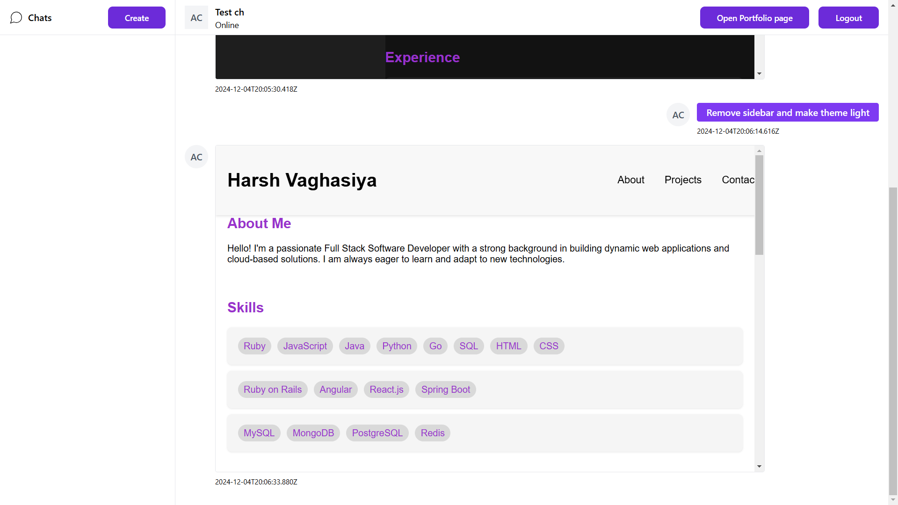
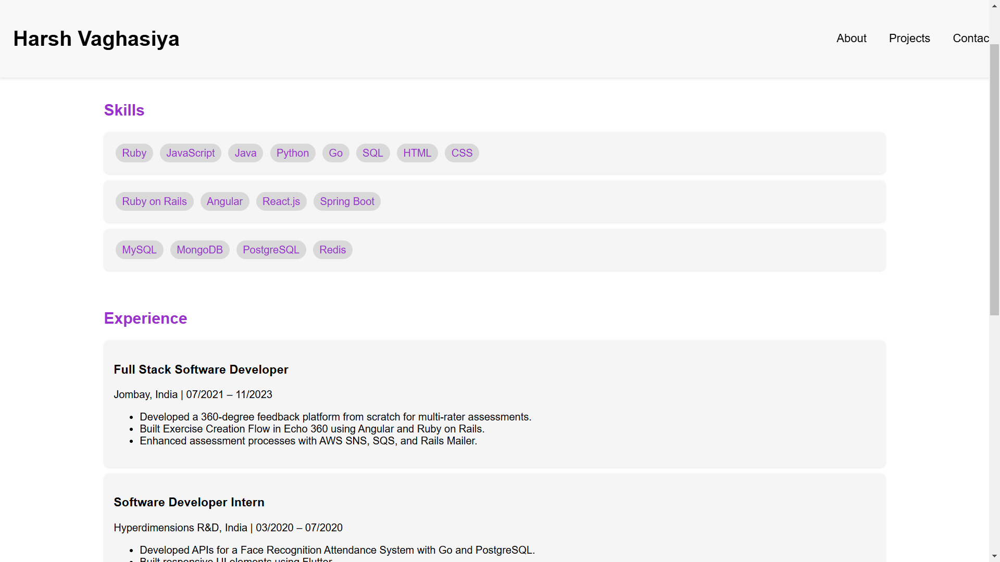
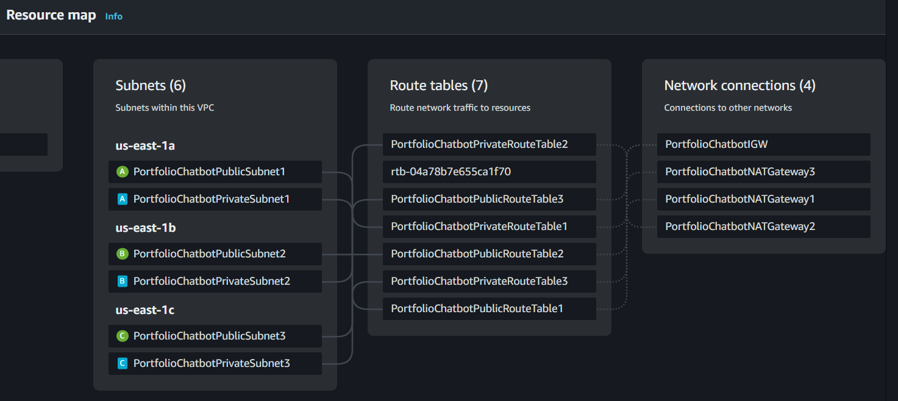
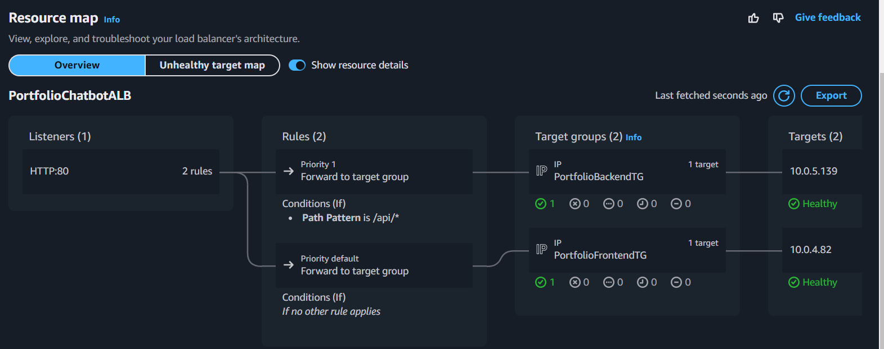
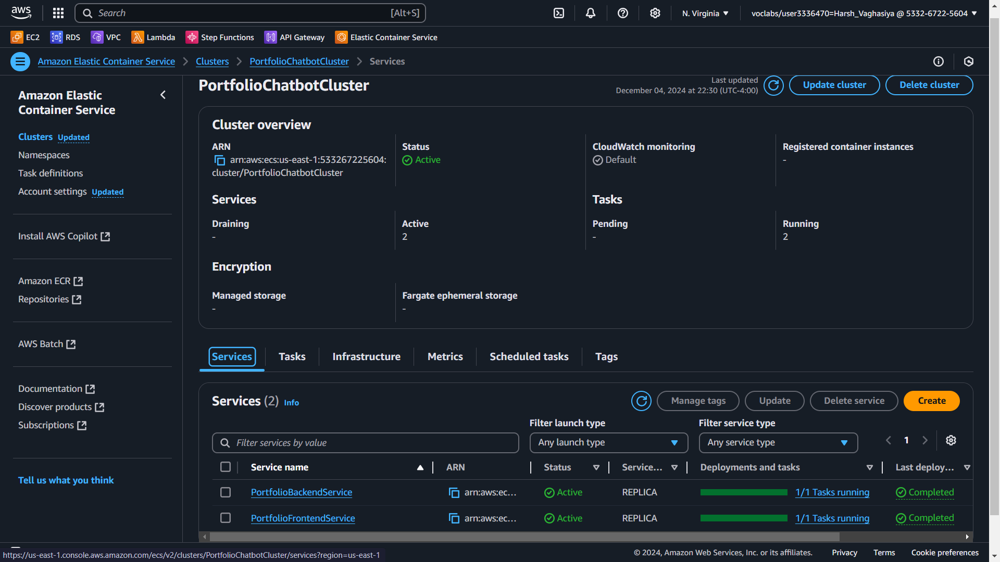

# GenAI Portfolio Webpage Generator Chatbot

The GenAI Portfolio Webpage Generator Chatbot is an innovative cloud-based application designed to automate the creation of professional portfolio webpages. Users upload resumes, and the chatbot utilizes the ChatGPT API to dynamically generate visually appealing portfolio websites. These sites are deployed online for easy access, helping job seekers and professionals enhance their online presence effortlessly.

## Features

- **Resume Parsing**: Upload resumes for automatic extraction of relevant data.
- **Generative AI Integration**: Leverages ChatGPT to create professional portfolio webpages.
- **Cloud Deployment**: Fully hosted on AWS for scalability, security, and reliability.
- **User-Friendly Interface**: Intuitive React-based frontend for seamless interaction.
- **Backend in Node.js**: Modernized backend with efficient Express.js framework.
- **Secure and Scalable**: AWS services like DynamoDB, S3, ECS, and Secrets Manager ensure a secure, high-performance application.

---

## Application Images

### Login Page

### Signup Page

### Create Chat

### Chat Bot

### Hosted Portfolio

---

## Architecture Overview

The application is designed using a cloud-native architecture, leveraging various AWS services:

- **Frontend**: React application hosted on AWS Fargate.
- **Backend**: Node.js Express application running on AWS Fargate.
- **Database**: Amazon DynamoDB for user profiles and chat histories.
- **Storage**: Amazon S3 for storing resumes and hosting portfolio pages.
- **Networking**: Amazon VPC with Application Load Balancer for routing and NAT Gateways for secure backend access.
- **Security**: AWS Secrets Manager for API key storage and IAM roles for least-privilege access.
- **Monitoring**: Amazon CloudWatch for resource utilization and performance metrics.

### Architecture Diagram

### VPC Resource map

### Application Load Balancer Resource map

### ECS services

---

## AWS Services Used

1. **Compute**: AWS Fargate (ECS) for serverless containerized deployments.
2. **Storage**: Amazon S3 for durable and scalable object storage.
3. **Database**: DynamoDB for high-performance, NoSQL data storage.
4. **Networking**: Application Load Balancer and NAT Gateways for traffic management and secure internet access.
5. **Security**: AWS Secrets Manager and IAM for secure credential management.
6. **Monitoring**: CloudWatch for real-time system monitoring and SNS for alerts.

---

## Deployment

### Steps to Deploy

1. **CloudFormation Template**: Use the provided CloudFormation template to automate the provisioning of AWS resources.
2. **Docker Image Management**: Build and push the frontend and backend images to Amazon Elastic Container Registry (ECR).
3. **ECS Services**: Configure and deploy ECS services for the frontend and backend.
4. **Static Hosting**: Enable static website hosting for portfolio webpages in Amazon S3.
5. **Validation**: Access the application via the ALB DNS name to verify functionality.

### Public URL
[Access the Application](http://portfoliochatbotalb-2070134174.us-east-1.elb.amazonaws.com/)

---

## Cost Estimation

| **Service**         | **Estimated Monthly Cost** |
|----------------------|----------------------------|
| Compute (Fargate)   | $18.00                     |
| Storage (S3)        | $0.70                      |
| Networking (VPC+ALB)| $118.74                    |
| Database (DynamoDB) | $4.80                      |
| Monitoring (CloudWatch)| $3.51                  |
| Security (Secrets Manager)| $2.00              |
| **Total**           | **$147.75**               |

---

## Challenges and Solutions

- **HTTPS Configuration**: Restricted in AWS Learner Lab; mitigated using HTTP with network security best practices.
- **Resource Quotas**: Optimized resource allocation for cost-efficiency.
- **API Key Security**: Implemented AWS Secrets Manager for dynamic credential management.
- **Traffic Management**: Configured path-based routing in ALB for efficient frontend-backend communication.

---

## Future Enhancements

- **Enable HTTPS**: Integrate AWS Certificate Manager and CloudFront.
- **Enhanced Monitoring**: Utilize advanced monitoring tools for deeper insights.
- **Custom Domain**: Configure Route 53 for domain management.

---

## Author

- **Name**: Harsh Vaghasiya
- **Email**: [harshvagh123@gmail.com](mailto:email@example.com)
- **Institution**: Dalhousie University, CSCI 5411 Advanced Cloud Architecting (Fall 2024)
